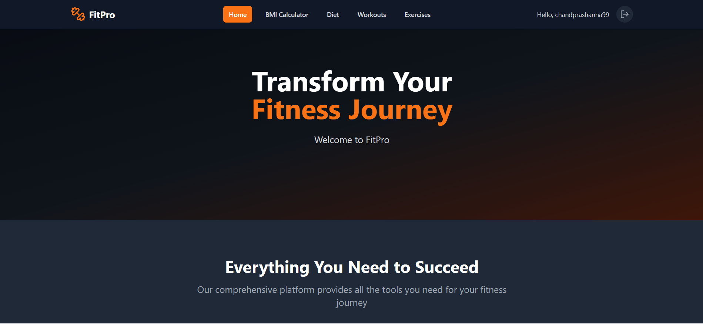
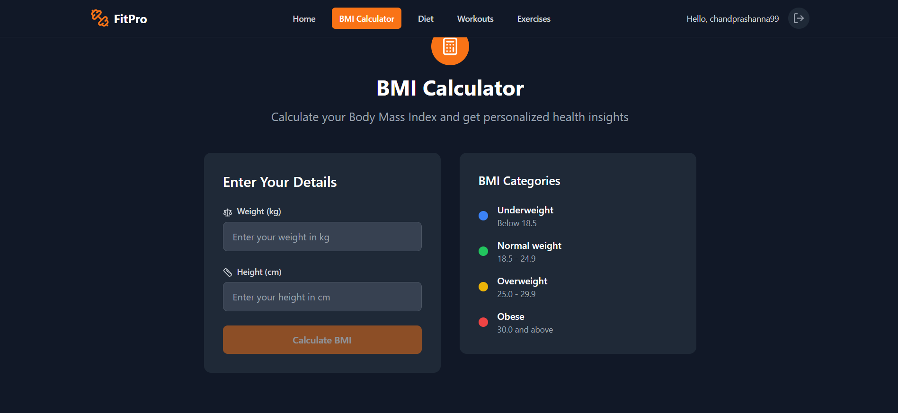
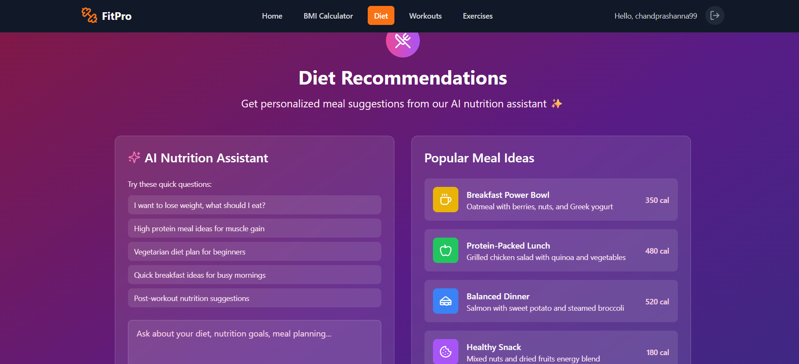
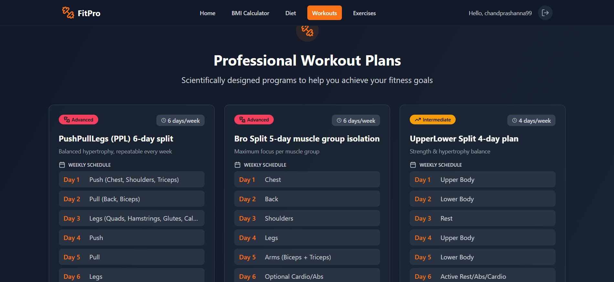
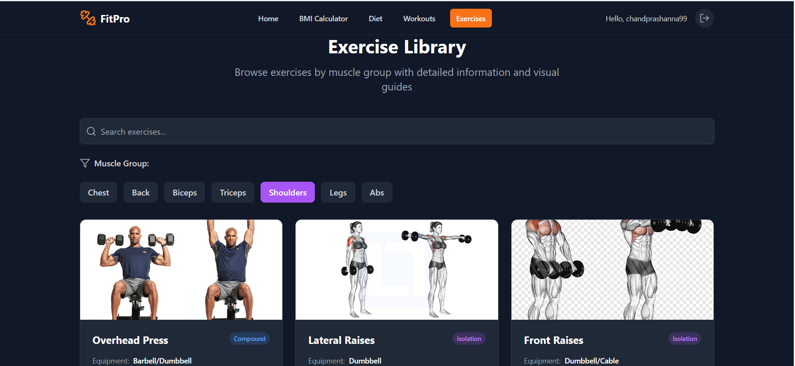

# 🌩️ Cloud Application and Development Foundation
## Course Project: ByayamShala  

> *Department of Software Engineering*  
> *Nepal College of Information Technology (NCIT)*  
> *Pokhara University*


---

## 🧑‍🤝‍🧑 Team Members
### Group Number: XX
| Name | Roll Number | Role |
|------|------------|------|
| Prashanna Chand | 221630 | Backend Dev & ML |
| Binita Pokharel| 221710 | Frontend Dev and UI |


---

## 📌 Project Abstract


> Our project is a full-stack fitness web application using Django for the backend and React for the frontend. It provides core functionalities such as BMI calculation, explore globally practices workout schedules, diet recommendations, and detailed exercise information. The app will be hosted on AWS, leveraging cloud-native practices including containerization (Docker) and CI/CD pipelines for scalable, reliable, and maintainable deployment.

---

## ⛳ Problem Statements
- Challenge:
Many beginners in fitness find it difficult to access simple, centralized guidance for basic health metrics and workout planning. They often get overwhelmed by complex apps or scattered information, lacking an easy-to-use platform focused on foundational features like BMI calculation, workout schedules, diet recommendations, and exercise details.

- Context:
Cloud computing enables scalable, accessible applications that can deliver fitness guidance anytime and anywhere. Using AWS cloud services ensures that the application is reliable and can efficiently serve users without worrying about infrastructure limitations.

- Impact:
This beginner-focused fitness app lowers the entry barrier for new users by providing straightforward, essential tools for starting their fitness journey. The cloud-native design ensures cost-effective scalability and availability, making it easier for beginners to adopt and stay motivated with accessible workout and diet recommendations.


---
## 🎯  Project Objectives

> Develop a  web app using cloud services.
> Implement scalability and serverless computing using AWS Lambda and Auto Scaling.
> Ensure performance and security.
> Demonstrate integration with AWS cloud services.

---

## 🏗️ System Architecture

### Frontend
Built using **React**, the frontend provides a user-friendly interface for workout planning, BMI calculation, diet recommendations, and exercise details. It interacts with the backend via REST API calls.

### Backend
Developed with **Django REST Framework**, the backend handles business logic, user authentication, and API endpoints for data retrieval and manipulation. It processes requests from the frontend and communicates with the database.

### Database
Stores user data, workout schedules, diet plans, and other application data. Initially using **SQLite** for simplicity, but can be migrated to more scalable databases like **PostgreSQL** in production.

### Cloud Services
Hosted on **AWS**, leveraging services like **EC2** or **Lambda** for backend hosting, **S3** for static file storage, **API Gateway** for routing, and **CodePipeline** for CI/CD automation. Monitoring and logging are managed using **CloudWatch**.


---

## 🔧 Technologies & Tools Used

List the major technologies and tools used in your project:

### ☁️ Cloud Platform
- Amazon Web Services (AWS) 

### 💻 Programming Languages
- JavaScript / Python 

### 🗄️ Databases
- SQlite

### 🛠️ Frameworks & Libraries
- React / Django / Django Rest Framework

### 📦 DevOps & Deployment
- Docker 

### 📡 APIs & Integration
- RESTful APIs 

---


## 🚀 Implementation Highlights


> Core Features Implemented:
BMI calculation, personalized workout schedules, diet recommendations, and detailed exercise information accessible via a React frontend.

> Challenges Faced:
Managing seamless integration between frontend and backend, ensuring low latency responses, and handling real-time updates without complex infrastructure.

> Solutions Adopted:
Used AWS Lambda with API Gateway to implement backend logic for automatic scaling and cost efficiency. React frontend consumes APIs for smooth user interaction.

> Key Decisions:
Chose AWS Lambda over EC2 to avoid server maintenance and leverage pay-per-use pricing, enabling a scalable, cost-effective backend.


---

## 🌌 Testing & Validation

- Unit Testing:
Individual backend API endpoints were tested using Django REST Framework’s test client and Postman to verify correct input/output behavior and error handling.

- Integration Testing:
Tested end-to-end workflows between the React frontend and AWS-hosted backend APIs to ensure data flows correctly and UI updates as expected.

- Load/Performance Testing:
Conducted basic load testing using tools like Apache JMeter to simulate multiple users, confirming the serverless backend scales effectively under typical user load.

- Security Testing:
Validated secure handling of user data via HTTPS endpoints and ensured proper validation on input fields to prevent common vulnerabilities like injection attacks.


---

## 📊 Results & Performance

- Response Time:

Average API response time: ~150-250 ms for typical requests.

Frontend UI updates within 300 ms after receiving data.

- Scalability Under Load:

Backend uses AWS Lambda with auto-scaling, handling up to hundreds of concurrent users without degradation.

Load tests showed stable performance with 500 simulated users.

- Uptime/Downtime:

Hosted on AWS with 99.9%+ SLA, ensuring near-continuous uptime.

No downtime observed during testing period.

- Cost-Efficiency:

Serverless architecture and pay-per-use billing optimized costs, especially during low traffic periods.

Minimal infrastructure management reduced operational expenses.

---

## 📷 Screenshots / UI Preview






---

## 📁 Repository Structure


```bash
project/
│
├── frontend/
│   ├── Dockerfile
│   ├── public/
│   └── src/
├── backend/
│   ├── Dockerfile
│   ├── app
│   ├── backend
│   └── manage.py
├── docker-compose.yml
├── README.md
└── .gitignore
```

---

## 📈 Future Enhancements

In our current project there are manyy enhancements thet we can list , such as : 
- AI-powered personalized workout and diet plans based on user goals and progress data
- Mobile app integration to let users access workouts, diets, and BMI tracking anywhere
- Progress tracking dashboard with charts and insights to motivate beginners
- Community features for sharing workouts, recipes, and encouraging others
- Integration with popular fitness wearables (e.g., Fitbit, Apple Watch) to sync activity data
- Multi-cloud deployment to ensure high availability and scalability
- Voice assistant support for hands-free workout guidance and reminders
- Gamification features like badges and challenges to increase user engagement

---

## 🙏 Acknowledgments

We would like to sincerely thank my faculty mentors for their invaluable guidance and support throughout the project. Special thanks to our colleagues and friends who provided encouragement and feedback during development. We also acknowledge the vast community of online resources and open-source projects that made this work possible.
---

